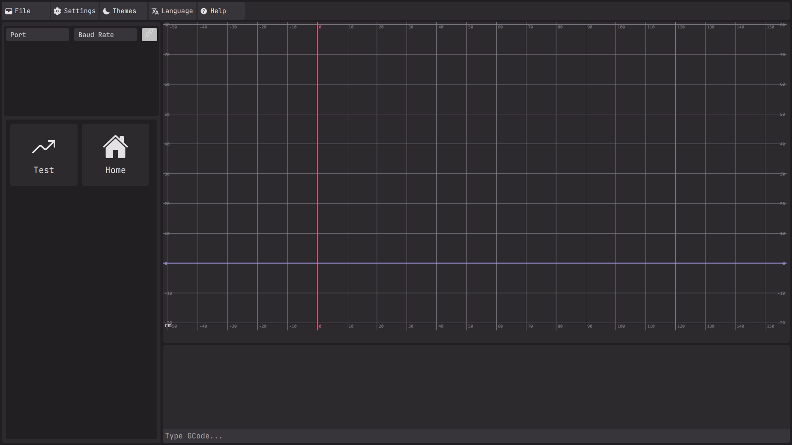

# J-CNC
Is an open source alternative to LightBurn and LaserGRBL running natively on Linux and written in Java and React.


## Building from source
To build J-CNC from source just follow these instructions
```bash
git clone https://github.com/CommandJoo/J-CNC
cd J-CNC
cd frontend
npm run build
cd ..
./gradlew run
```

## TODO
### Connection logic/ui:
- port selection
- baudrate selection
- connect/disconnect buttons
- connection status

### Job execution:
- start button
- pause/resume button
- stop button
- progress/current line

### Lock ui when running:
- buttons
- console input
- file loading
- connection settings

### Terminal improvements:
- auto scroll
- timestamps
- colored messages
- clear button

### Preview improvements:
- current machine position
- current executing line
- zoom to fit
- grid toggle

### GCode parsing:
- comments
- arcs (G2/G3)
- relative coordinates
- feedrate/spindle parsing

### Machine status:
- parse GRBL status messages
- machine/work coordinates
- alarm handling

### Svg conversion:
- scaling
- positioning
- laser power
- feedrate

### Settings:
- save baudrate
- save last port

### Safety:
- emergency stop
- disconnect handling
- reset handling